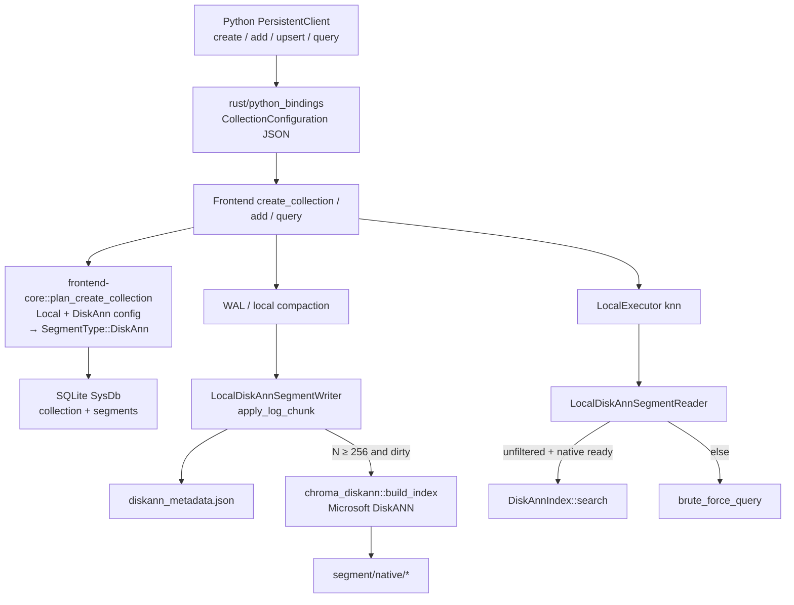

# 本地 PersistentClient + Microsoft DiskANN

本文说明这次集成**做了什么**、冒烟脚本**那次 OK 输出代表什么**、以及代码如何串起来。范围仅限 **local Python / PersistentClient**，不包含 distributed query/compaction worker。

仓库布局约定：

```text
<parent>/
  chroma_diskann/          # 本仓库
  DiskANN/                 # Microsoft DiskANN Rust crates（path 依赖）
```

`rust/diskann/Cargo.toml` 通过 `../../../DiskANN/{diskann,diskann-disk,diskann-providers,diskann-vector}` 引用算法实现。

---

## 1. 冒烟结果对照（你这次跑通的输出）

命令：

```bash
python examples/diskann/local_persistent.py
```

对应脚本：`examples/diskann/local_persistent.py`。

### 1.1 `collection configuration` 里有 `diskann` 而不是 `hnsw`

```text
'diskann': {'space': 'l2', 'graph_degree': 32, ..., 'pq_bytes': 8, 'num_threads': 128, ...}
'hnsw': None
```

含义：`create_collection(configuration={"diskann": {...}})` 成功选中 DiskANN。本地默认 KNN 仍是 HNSW，但**显式 diskann 不能被改写成 HNSW**（见第 4.2 节）。未写的字段被填成默认值（`pq_bytes=8`、`num_threads=可用核数` 等）。

### 1.2 step 1：`small-n query ids: [['a']]`，`native dirs: []`

只插入了 `a`、`b` 两个 8 维向量。查询 `[0.1, 0.2, 0, …]` 最近邻是 `a`，这是 **exact scan**（暴力算距离），因为 N=2 < 256。

磁盘上此时最多有 `diskann_metadata.json`（id 映射 + 向量），**不会**出现 `native/`。Microsoft DiskANN 建图要求至少 256 个点。

### 1.3 step 2：`large-n query ids: [['id-0', 'b', 'a']]` 且出现 `native/`

`upsert` 了 `id-0` … `id-255`（256 条），加上原来的 `a`、`b`，活向量 **258 ≥ 256**。compaction 调用 DiskANN builder，写出：

```text
<persist_dir>/<segment_uuid>/native/
  index_disk.index
  index_pq_compressed.bin
  index_pq_pivots.bin
  manifest.json
  vectors.fbin
```

查询 `[0.0, 1.0, 0, …]` 得到 `id-0, b, a`：`id-0` 是 `[0,1,0,…]`，与 query 最接近；`b`、`a` 是先前的点。无 `where` 过滤且 native 已就绪时走 **原生图搜索**（失败会退回 exact scan）。

`OK` 表示 `rglob("native")` 找到了上述目录。

---

## 2. 架构（请求怎么走到 DiskANN）



和 HNSW 本地路径对齐：

| 层 | HNSW | DiskANN |
| --- | --- | --- |
| 配置 | `configuration={"hnsw": …}` | `configuration={"diskann": …}` |
| Segment URN | `urn:chroma:segment/vector/hnsw-local-persisted` | `urn:chroma:segment/vector/diskann` |
| 写路径 | `local_hnsw` | `local_diskann` |
| 索引文件 | hnswlib 二进制 | Microsoft DiskANN `native/` |
| N 很小 | 仍建 HNSW | **不建图，exact scan** |

Distributed 规划里若看到 DiskANN 会直接 `DiskAnnNotSupported`，没有 worker 实现。

---

## 3. 写路径与读路径（逐步）

### 3.1 创建 collection

1. Python 把 `{"diskann": {"graph_degree": 32, "search_list_size": 64}}` 编成 JSON。
2. `InternalCollectionConfiguration::try_from_config`：**只要用户给了 `diskann`，内部类型就是 `VectorIndexConfiguration::DiskAnn`**，不管 `default_knn_index` 是不是 HNSW。
3. `Schema::reconcile_schema_and_config`：即便 DiskANN 参数全是默认值（`is_default()==true`），也不能用 `Schema::new_default(Hnsw)` 盖掉，否则会静默变回 HNSW。
4. `plan_create_collection(ExecutorKind::Local)`：schema/config 带 DiskANN 时，VECTOR segment 类型设为 `SegmentType::DiskAnn`。

### 3.2 add / upsert

1. 记录进 SQLite WAL。
2. `LocalCompactionManager` 看到 VECTOR segment 是 DiskAnn，取 `get_diskann_writer`，`apply_log_chunk`。
3. Writer 更新内存 `IdMap`（user id ↔ offset label ↔ embedding），设 `dirty=true`，丢掉旧 `native_index`。
4. `persist()`：
   - 始终写 `diskann_metadata.json`（查询/重启都靠它做 exact scan）。
   - 若 `embeddings.len() >= 256 && dirty`：删旧 `native/`，`build_index`，再 `DiskAnnIndex::open`，把行顺序记进 `native_labels`。
   - 若 N < 256：清掉 native 目录。

每次 mutation 都是 **全量重建图**（DiskANN 磁盘图不可增量改）。数据量变大后 rebuild 会变贵，这是当前刻意简化。

### 3.3 query

`LocalExecutor` 与 HNSW 相同：先 metadata 过滤得到 user id 列表，再转 offset id，再 `query_embedding`。

`query_embedding` 使用 native 的条件（全部满足）：

- 没有 allow-list（无 `where`）
- `!dirty`
- `native_index` 已打开
- `native_labels` 与当前 embeddings 数量、key 一致

否则 exact scan。原生 search 返回的是 **建图时的行号**，用 `native_labels[row]` 还原 Chroma offset id。

---

## 4. 关键代码文件

| 文件 | 职责 |
| --- | --- |
| `rust/types/src/diskann_configuration.rs` | DiskANN 配置默认值与校验 |
| `rust/types/src/collection_configuration.rs` | `hnsw` / `spann` / `diskann` 三选一；禁止把显式 DiskANN 改成 HNSW |
| `rust/types/src/collection_schema.rs` | schema 上的 `VectorIndexConfig.diskann`；调和时保留 DiskANN |
| `rust/types/src/segment.rs` | `SegmentType::DiskAnn` URN |
| `rust/diskann/` | Microsoft crates 的适配层：`build_index` / `DiskAnnIndex::open` / `search` |
| `rust/segment/src/local_diskann.rs` | 本地 segment 读写、persist、native vs brute force |
| `rust/segment/src/local_segment_manager.rs` | 进程内 DiskANN index pool |
| `rust/log/src/local_compaction_manager.rs` | compaction 把 WAL 打到 DiskANN writer；错误带真实原因 |
| `rust/frontend-core/src/collection_ops.rs` | local 允许 DiskAnn segment；distributed 拒绝 |
| `rust/frontend/src/executor/local.rs` | knn / get embedding 走 DiskANN reader |
| `chromadb/api/collection_configuration.py` | Python TypedDict `diskann` |
| `chromadb/api/types.py` | `DiskAnnIndexConfig` |
| `examples/diskann/local_persistent.py` | 冒烟 |
| `examples/diskann/test_local_linux.sh` | 找 DiskANN 源码、venv、`pip install -e .`、跑冒烟 |

---

## 5. 磁盘布局

```text
PERSIST_DIR/
  chroma.sqlite3                 # collection / segment / WAL / metadata
  <vector-segment-uuid>/
    diskann_metadata.json        # IdMap：ids、labels、vectors、native_labels
    native/                      # 仅 N ≥ 256
      manifest.json
      vectors.fbin               # 原始 float 矩阵（含 header）
      index_disk.index
      index_pq_compressed.bin
      index_pq_pivots.bin
```

`persist_path` 是 `PERSIST_DIR/<segment_id>`，与 HNSW 本地目录习惯一致。

---

## 6. 行为约束（实现时踩过的坑）

1. **N ≥ 256 才有 native 图**。更小的集合查询仍然正确，只是 O(N) scan。
2. **过滤查询不走 native**。DiskANN 适配层没有 where 下推。
3. **`pq_bytes=0` 不能直接传给 native builder**。适配层 clamp 为 `max(1).min(dim)`。默认 `pq_bytes=8`，冒烟用 8 维向量就是为了对齐这个默认。
4. **`graph_degree` 必须小于点数**。默认 R=32，所以 256 点够用。
5. **显式 `diskann` + 本地默认 HNSW** 曾经被 `try_from_config` / schema reconcile 改成 HNSW：查询成功但永远没有 `native/`。现已禁止改写。
6. **compaction 错误**以前一律报 `Failed to apply logs to the hnsw segment writer`。DiskANN 失败现在是 `Failed to apply logs to the DiskANN segment writer: …`。

---

## 7. 再跑一遍

DiskANN 与 chroma_diskann 必须是兄弟目录（或 `export DISKANN_ROOT=...`）：

```bash
cd /path/to/chroma_diskann
source .venv/bin/activate   # 若已有
pip install -e .
export PERSIST_DIR=./chroma-diskann-testdata
rm -rf "$PERSIST_DIR"
python examples/diskann/local_persistent.py
```

或：`./examples/diskann/test_local_linux.sh`（会装依赖并编译 Rust）。

---

## 8. 刻意未做

- Distributed DiskANN（query/compaction service、blockfile、SPANN 风格 sharding）
- 增量插入磁盘图（每次 dirty 全量 rebuild）
- 过滤查询的 native 路径
- 把本地默认索引从 HNSW 改成 DiskANN（用户必须显式 `configuration={"diskann": …}`）
